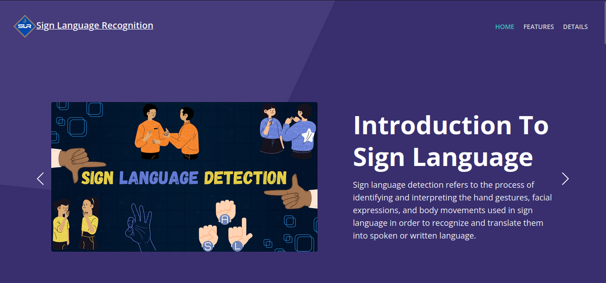
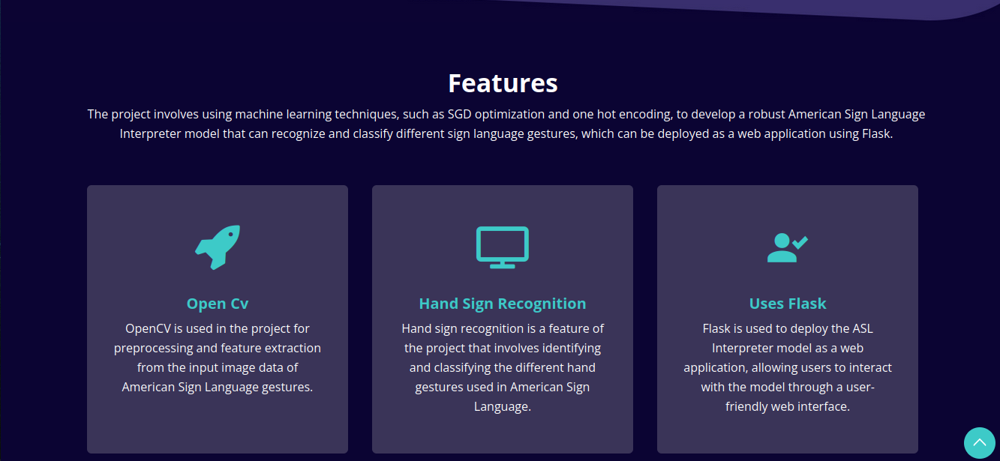
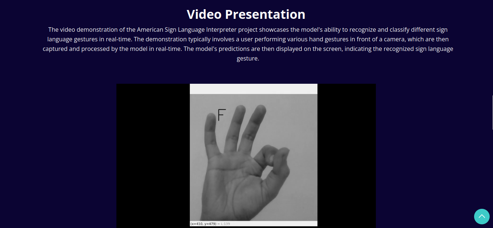
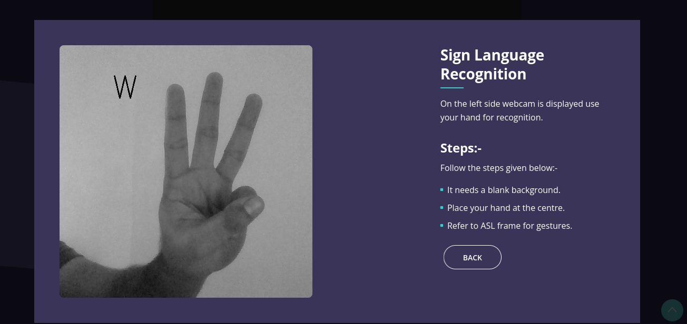
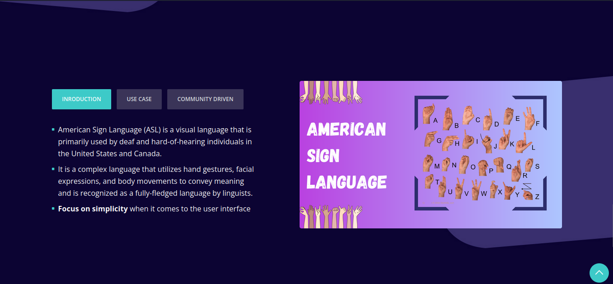

# Asl Sign Language Recognition using flask and opencv


### Screenshots







# Setup 

1. Install python

2. Install any virtual environment software of your choice
    
3. Clone this repository and cd into the project directory and activate the virtual environment.

4. Install dependency

    ```shell
   
    pip install -r requirement.txt

   ```

5. Run the application

   
    ```shell

    python app.py -i 0.0.0.0 -o 8080

    ```


